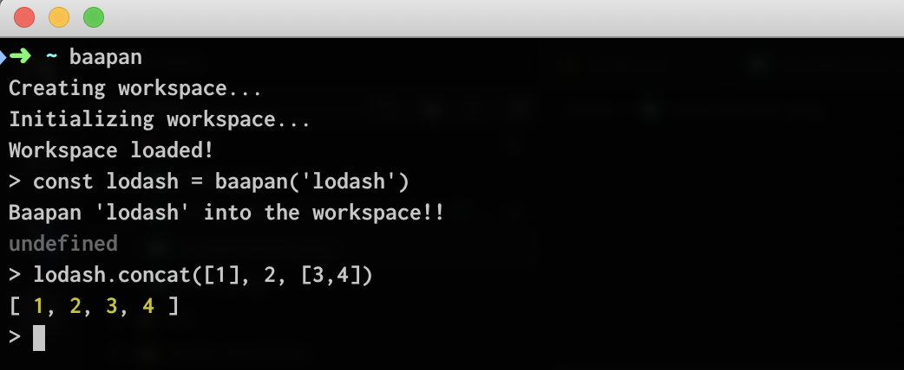

# Baapan


Are you a guy who uses Node.js REPL to quickly try out some things while coding?

Do you wish if the Node.js REPL had all the NPM modules preloaded in order to ease your local tests. For an example `lodash` to do some object/array magic on your data?

Do you wish if there's something like [RunKit](https://runkit.com) on top of the good 'ol Node REPL?



**Baapan is a NodeJS REPL extension module which will provide a convenient 'require'-like function to dynamically install and load a module you want?**

### How?

#### Install baapan

```sh
npm install baapan
```
#### Load baapan with REPL

```sh
node --require baapan --experimental-repl-await
```
**Important!!** Baapan relies on `async-await` in REPL, therefore you need to enable the use of `async-await` in REPL using `--experimental-repl-await` flag.

#### Use `await baapan()` instead of `require`

```js
> const lodash = await baapan('lodash')
+ lodash@4.17.11
updated 1 package and audited 24204 packages in 2.501s
found 0 vulnerabilities

> lodash.concat([1], 2, [3,4])
[ 1, 2, 3, 4 ]
```

Baapan will immediately download the module via `npm` and `require` it so that it's available on the REPL!!!!

-----------------

_Logo from:_

<a href="http://cooltext.com" target="_top"></a>